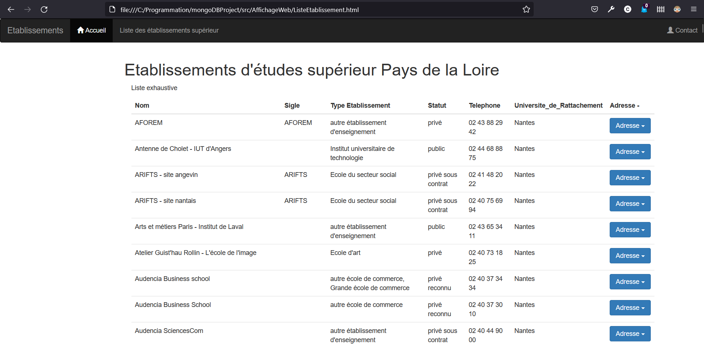
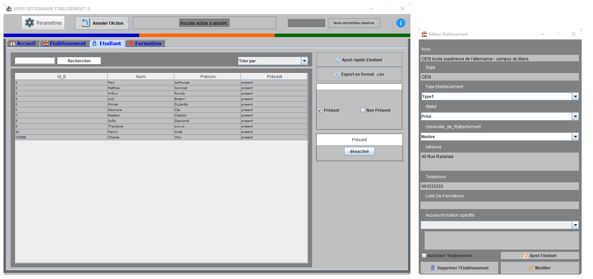
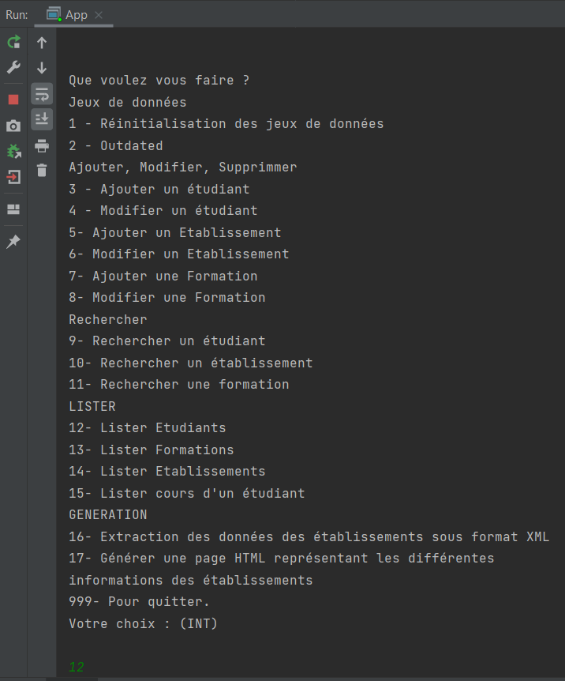

# :school: MongoDB :school:

## Base de données MongoDB avec implémentation Java Maven

| Propriétés      | Valeur                 |
| --------------- | ---------------------- |
| Langage         | Java                   |
| Base de données | MongoDB                |
| patterns        | DAO & Singleton        |
| Framework       | Maven                  |
| Dependencies    | MongoDB, Jakarta, Jaxb |
| Paramétrage     | config.properties      |
| IDE             | IntelliJ               |

**Fonctionnalités** : Injection de json, extraction des données en format XML par JAXB et génération de pages web avec une transformation XSLT.

---

## Diagramme UML du programme

 
 
 ## Fonctionnement
 
 ### Introduction
 
Le sujet posé s’intéresse à la gestion des Etablissements : ses Etudiants, ses Diplomes, ses Formations, stockés sur un fichiers json. L’idée est d’analyser le sujet, de le modéliser via des classes Java et de pouvoir automatiser sa gestion avec JAVA sur IntelliJ.

### Maven

Pour la gestion du projet nous avons utilisé Maven qui permet de gérer les dépendances dans un projet Java.
Le projet est découpé en quatre packages : main, dao, model, GUI. Le package « main » correspond aux classes qui vont permettre d’exécuter le projet. Les packages « dao » et « model » correspondent aux classes utilisées dans le pattern Dao. Puis le package GUI contient des classes de Jframe nécessaire à l’affichage graphique. Le fichier pom.xml gère les dépendances liées aux librairies Jakarta et MongoDB. Le fichier config.properties regroupe les paramètres essentiels pour se connecter à la base de données.

### Configuration

Arrivé dans Intellij il faut importer un projet Maven existant. Dans le fichier config.properties il faut modifier les chemins d’accès en fonction du serveur NoSql-MongoDB de l’utilisateur.

```{java}
url=mongodb://localhost:27017
database=Projet2022
```

### Données

Notre serveur MongoDB possède une Database, dans celle-ci nous constituons les collections suivantes : Adresse, Etablissement, Etudiant & Formation.
Les BDD MongoDB fonctionnent avec des Documents utilisant le format JSON.
Ce format permet de représenter de l’information structurée. Nous chargeons le fichier json contenant l’ensemble des établissements d’enseignement supérieur en Pays de la Loire dans notre Database. De plus nous ajoutons Manuellement grâce aux DAO, 10 Etudiants et 10 formations.

### Pattern Singleton

Nous avons utilisé le pattern Singleton pour établir le lien entre notre base et l’implémentation Java, il sert à mettre en place la connexion entre les deux. L’idée est de créer un objet Connection contenant la connexion déclaré en private. Ce pattern est mis en place dans la classe « MongoDBConnection », cette classe récupère les informations contenues dans le fichier config.properties.

### Pattern DAO et pattern Factory

Pour mettre en place le pattern DAO nous avons créé une classe pour chacun des objets, ces classes sont composées des propriétés correspondantes au champs des tables et des getters et setters (le package model). Pour chacune de ces classes on a créé une classe qui réalise les manipulations dans la base de données (AdresseDAO, EtablissementDAO, EtudiantDAO, FormationDAO). Ces dernières permettent de réaliser six opérations sur les données

- create(T obj) : boolean , pour créer un nouveau document dans une collection
- update(T obj) : boolean, pour mettre à jour un document dans une collection, -
- find(id) : T, pour rechercher un document dans une collection
- delete(T obj) : boolean, pour supprimer un document dans une collection
- findAll() : ArrayList, pour afficher tous les documents d’une collection

Ces classes sont une extension de la superclasse « Dao » pour gérer correctement les connexions avec la base.

Le pattern Dao est accompagné du pattern Factory, il permet de déléguer l’instanciation des objets à une classes, les objets DAO sont ainsi créés par celle-ci.

### Exécution

Dans la classe « App, Il suffit d’appeler le constructeur des DAO pour pouvoir l’utiliser, notre code de la classe DAO présente les fonctionnalités complètes.

---

### GUI

#### GUI WEB

Site Bootstrap Contenant la Liste des établissements


#### GUI Spring

Interface permettant de réaliser les différentes opérations sur les collections


#### GUI Terminal

Sélection des actions à réaliser sur les données via le terminal



---

### Propriétés de la base MongoDB

#### Orienté documents

Orienté documents, les Bases NoSQL MongoDB sont les plus populaires,
MongoDB est saluée pour la souplesse de sa structure et sa capacité à répondre à un grand nombre de besoins.

#### BASE

- **B**asically **A**vailable: quelle que soit la charge de la base de données (données/requêtes), le système garantie un taux de disponibilité de la donnée
- **S**oft-state : La base peut changer lors des mises à jour ou lors d'ajout/suppression de serveurs. La base NoSQL n'a pas à être cohérente à tout instant
- **E**ventuallyconsistent : À terme, la base atteindra un état cohérent

#### Théorème CAP

- **C**onsistency(Cohérence) : une donnée n'a qu'un seul état visible quel que soit le nombre de réplicas
- **A**vailability(Disponibilité) : tant que le système tourne (distribué ou non), la donnée doit être disponible•Partition
- **T**olerance(Distribution) : quel que soit le nombre de serveurs, toute requête doit fournir un résultat correct

On ne peut respecter au plus que 2 de ces propriétés, en effet une base MongoDB a très peu de disponibilité.
